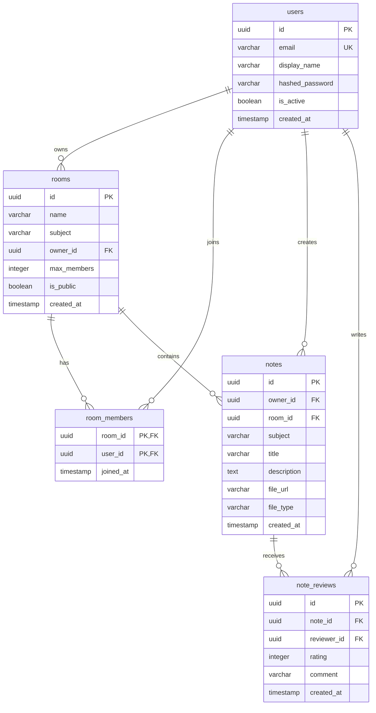

# StudySync — Database Schema

## Entity-Relationship Diagram

## Ephemeral State (Redis)

| Key Pattern | Type | TTL | Description |
|-------------|------|-----|-------------|
| `presence:room:{room_id}` | Set | - | Set of connected user IDs |
| `pomodoro:{room_id}` | Hash | duration + 5s | Current Pomodoro state |
| `user:{user_id}:pomodoros_completed` | Integer | - | Lifetime Pomodoro count |
